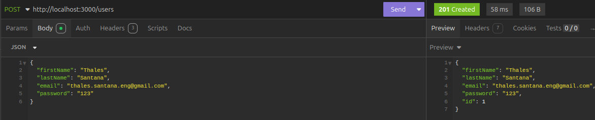
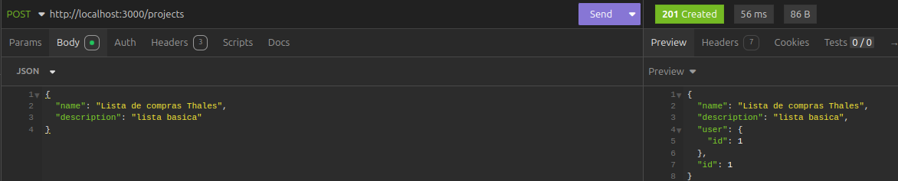
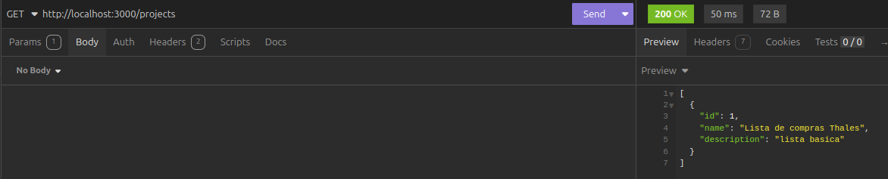
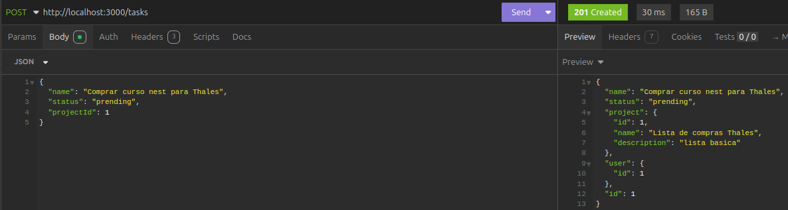
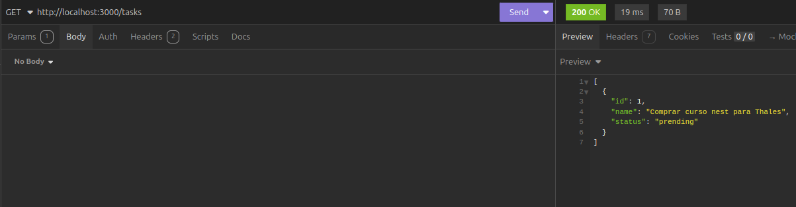
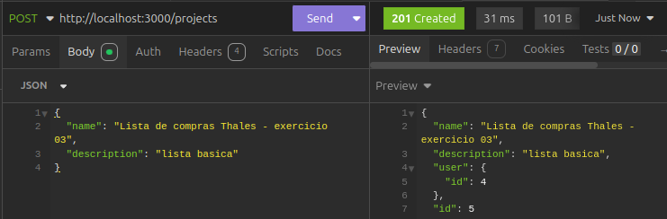

# API Project Manager

## Requisição `/users`

## Requisição `/projects`

## Listagem de Projetos

## Requisição `/tasks`

## Listagem de Tarefas

## Requisição `/projects` com autenticação

## Requisição `/users` para criar senha

## Requisição `/auth/login`
